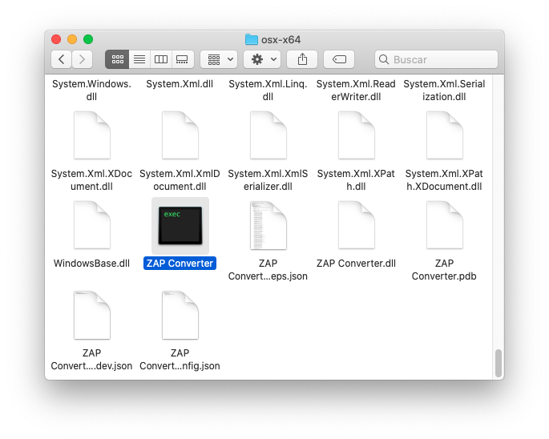

# ZAP Extractor

## Dependencias
para usar esta aplicacion necesitas un ordenador de [64-Bits](https://es.wikipedia.org/wiki/64_bits) y [netcore 3.1 (o posterior)](https://dotnet.microsoft.com/download/dotnet-core/3.1).

## Instalacion
1. Ve a la pestaña de [Releases](https://github.com/CalmGamesOfficial/ZAP-Extractor/releases).

2. Descarga la version mas reciente para el sistema operativo que tengas
 _(Si quieres descargar directamente la ultima version para windows haz click [aqui](https://github.com/CalmGamesOfficial/ZAP-Extractor/releases/download/1.2/Windows.zip))_.

3. Descomprime el archivo Zip y lanza el ejecutable ya sea desde la terminal o haciendo doble click en el.

  

## Como se usa 
1. Primero introduce la ruta de el archivo a extraer _(ya sea arrastrando el archivo o manualmente)_.

  

2. Luego introduce el directorio donde quieres guardar el archivo extraido.

  

3. Ahora introduce los campos que quieres que se muestren en el archivo extraido

  

4. Por ultimo introduce ``si`` y pulsa **enter** para hacer la extraccion, tras unos minutos finalizara la conversion.

    _(la duracion dependera de la velocidad de su procesador y del tamaño del archivo que estes extrayendo)_.

  

## Como añadir mas campos
En la version [1.2](https://github.com/CalmGamesOfficial/ZAP-Extractor/releases/tag/1.2) (y posteriores) se ha incluido la opcion de poder consultar varios campos

Para usar esta caracteristica simplemente cuando el programa le pida elegir un campo pongalo y añada una coma (__,__) y a continuacion ponga otro campo, repita este proceso con la cantidad de campos que desee, como se muestra en el ejemplo

  

## Errores Frecuentes :warning:

1. __``IO Error:``__ este error se produce cuando hay un error al cargar el archivo de entrada, si esto ocurre verifique que esta introduciendo correctamente el archivo y que no esta siendo usado por otro programa.

### Si sigue sin poder solucionar el problema por favor contacte conmigo mediante la pestaña de [Problemas](https://github.com/CalmGamesOfficial/ZAP-Extractor/issues)

 
